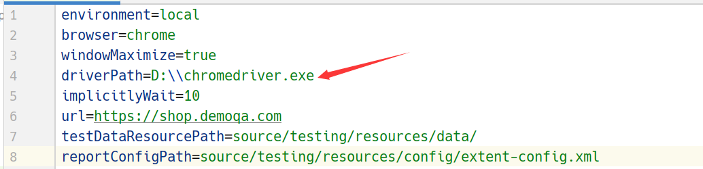

## Related articles

- [Test Driven Development-TDD](docs/TestDrivenDevelopment.md)
- [Behavior Driven Development-BDD](docs/BehaviorDrivenDevelopment.md)
- [Getting Started with Cucumber BDD for Testing in Agile Teams](docs/CucumberBDDTest_AgileTeams.md)
- [Cucumber Basic](docs/CucumberBasics.md)
- [Data Driven Testing](docs/DataDrivenTesting.md)
- [Cucumber Hooks](docs/CucumberHooks.md)

## Note

首先将项目目录下的chromedriver.exe文件拷贝到你本地电脑的D盘中，这是我们在这个示例项目中所必需的：



## Build Project

```shell
mvn clean test
```